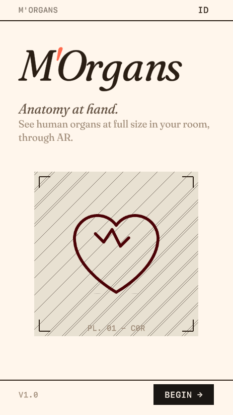
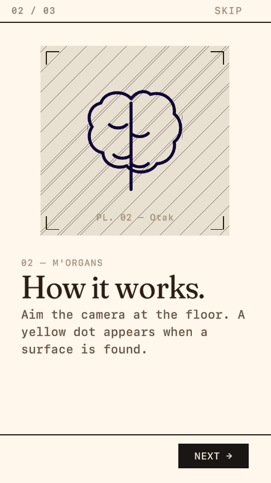
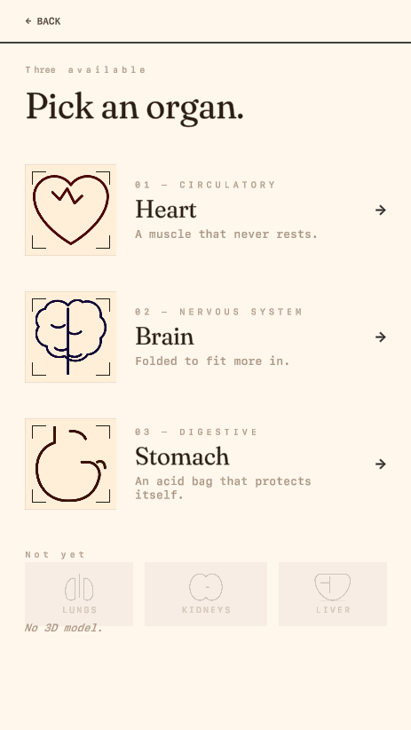
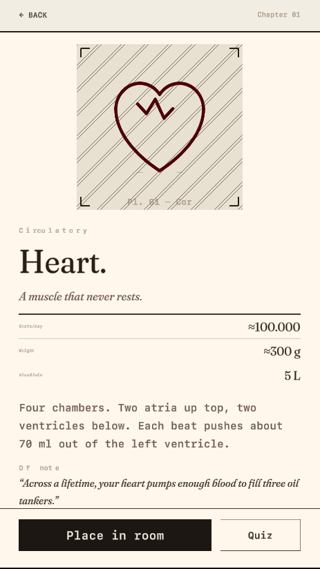
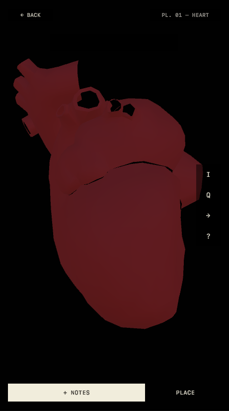

# M'Organs

An AR anatomy learning app for Android and iOS, built with Unity 6. Point your phone at a flat surface, tap to place, and a life-size 3D organ appears in your room. Each organ comes with a detail screen full of facts and a short quiz to test what you picked up.

The app currently covers six organs: heart (jantung), brain (otak), stomach (lambung), liver (hati), lungs (paru), and kidneys (ginjal). All text is bilingual in Indonesian and English, and users can switch between three color themes (light, dark, mint) from the settings screen.

> Course: **MOBI6069001 - LEC** · Binus University

## Screenshots

| Splash | Onboarding | Picker | Detail | AR |
|--------|------------|--------|--------|-----|
|  |  |  |  |  |

## How it works

The app loads a persistent scene (`_Persistent`) that holds singleton managers for app state, theming, localization, and scene transitions. From there, each screen is its own Unity scene. These include splash, onboarding, organ picker, detail view, AR placement, quiz, and settings.

Organ data lives in ScriptableObjects. Each `OrganDefinition` asset stores the organ's bilingual names, descriptions, a fun fact, a fact table, quiz questions with answers, a line-art icon, and a reference to the 3D model prefab. Adding a new organ means creating a new asset in the Unity inspector. No code changes are needed.

The AR scene uses AR Foundation with ARCore on Android and ARKit on iOS. Once a surface is detected, the user taps to place the organ model. Pinch to scale, drag to reposition. A collapsible bottom sheet shows organ info and facts while in AR view.

Theming is handled through `MO2ThemeData` ScriptableObjects (one per theme). Every screen subscribes to theme change events and recolors itself on the fly. The same pattern applies to language. If you switch from Indonesian to English, every label updates without reloading the scene.

## Tech stack

| Component | Details |
|-----------|---------|
| Engine | Unity 6 (URP) |
| AR | AR Foundation + ARCore / ARKit |
| Legacy AR | Vuforia 11.4.4 (migration bridge) |
| UI text | TextMeshPro |
| Tweening | LeanTween |
| Ads | Unity Ads 4.17.0 |
| Language | C# |

## Project structure

```
Assets/
  _Project/
    AR/             AR bridge, surface detection, placement logic
    Core/           AppState, LocalizationManager, ThemeManager, SceneLoader
    Data/           OrganDefinition + MO2ThemeData ScriptableObjects
    Fonts/          Inter, Fraunces, SF Mono + TMP font assets
    Icons/          SVG-sourced organ line-art sprites
    Prefabs/        UI component prefabs
    Scenes/         8 scenes (_Persistent through 07_Settings)
    UI/
      Components/   Reusable widgets (FactTableUI, OrganCardUI, QuizOptionUI, etc.)
      Screens/      One controller per scene (SplashController, PickerController, etc.)
  Editor/           Custom build tools (scene builder, icon builder, font builder)
  Organs/           3D organ FBX models
```

## Scenes

| # | Scene | What it does |
|---|-------|--------------|
| - | _Persistent | Loads first, stays loaded. Holds DontDestroyOnLoad managers. |
| 1 | 01_Splash | App entry with fade animation |
| 2 | 02_Onboarding | First-launch walkthrough (skipped after completion) |
| 3 | 03_Picker | Organ selection list |
| 4 | 04_Detail | Organ facts, fun fact card, navigation to AR and quiz |
| 5 | 05_AR | AR placement with pinch-to-scale and drag-to-reposition |
| 6 | 06_Quiz | 3-question quiz per organ |
| 7 | 07_Settings | Language, theme, sound, haptics toggles |

## Getting started

1. Clone the repo
2. Download **Vuforia Engine 11.4.4** from the [Vuforia Developer Portal](https://developer.vuforia.com/downloads/sdk) and place `com.ptc.vuforia.engine-11.4.4.tgz` inside the `Packages/` folder
3. Open in **Unity 6** (6000.0.x or later). Unity resolves the package on import.
4. Open `Assets/_Project/Scenes/_Persistent.unity` and press Play, or build for Android/iOS

AR needs a physical device. Android 8.0+ with ARCore support, or iOS 11+ with ARKit. In-editor, the AR scene falls back to simulated placement so you can still test the UI flow.

## License

MIT
